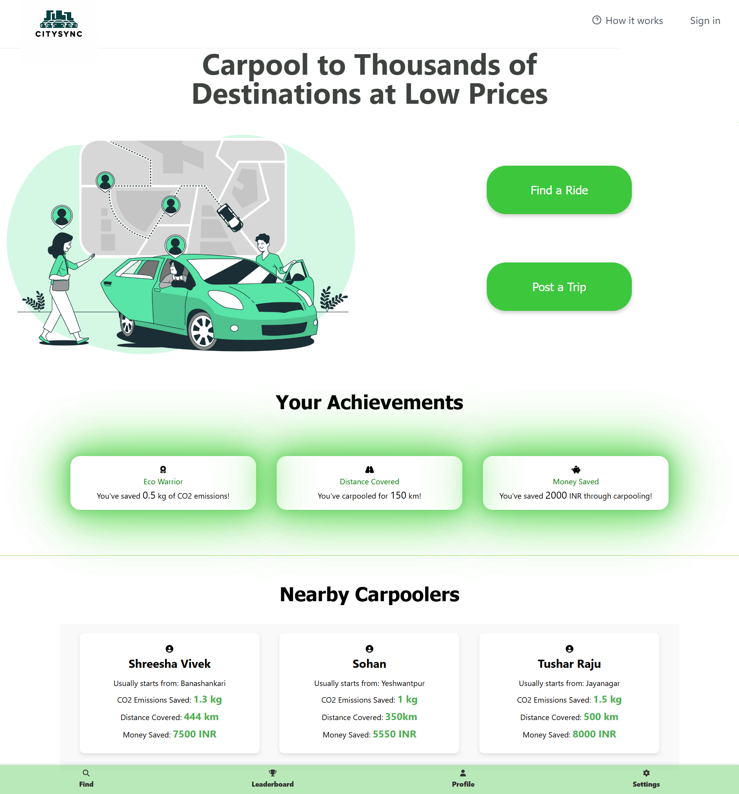
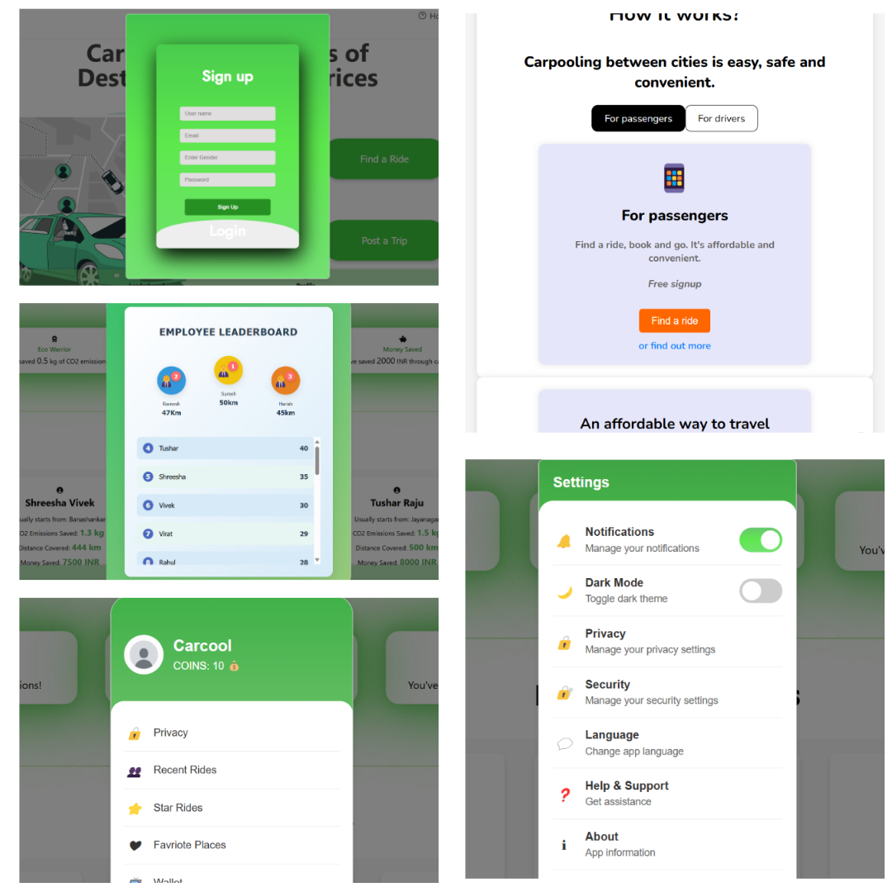

# Carpooling Website

## Project Overview
This project is a basic working website for carpooling, built using HTML, CSS, and JavaScript, with a JSON file as the backend for data fetching. The website allows users to find and book rides, facilitating a virtual carpooling network for employees of large companies or organizations.

## Features
- **Find a Ride**: Users can search for available carpool rides based on their commuting routes and schedules.
- **Book a Ride**: Users can book a ride from the available options.
- **User-Friendly Interface**: Simple and intuitive interface for easy navigation and use.

## Problem Statement
This project was built for the problem statement:
> "Create a virtual carpooling network for employees of large companies or organizations, where the system matches employees with similar commuting routes and schedules, facilitates carpool arrangements, and provides incentives such as preferential parking or toll discounts to promote carpooling and reduce solo commuting."

## Event Details
- **Competition**: I-SOLVE Hack the Bangalore Traffic
- **Organizers**: The ASE Club of NMIT in association with Bengaluru Traffic Police, IEEE CS/IT Society NMIT, and IEEE GRSS NMIT
- **Venue**: Nitte Meenakshi Institute of Technology, Bangalore, Karnataka
- **Duration**: 24-hour offline hackathon
- **Participants**: 746 registered members, top 30 teams shortlisted

## Team
- **Team Name**: JustForFun
- **Team Members**:
- sohan10012
- Tusharr06
- vivek-rg
- Shreesha2205

## Screenshots

## Acknowledgements
We would like to thank the organizers and all participants for making this event a great learning experience. Although we did not win, being shortlisted in the top 30 teams was a significant achievement.

## How to Run the Project
1. Clone the repository.
2. Open `index.html` in your web browser.
3. Ensure the JSON file is in the correct directory for data fetching.

## Contact
For any queries or further information, please contact [sohan10012006@gmail.com].
